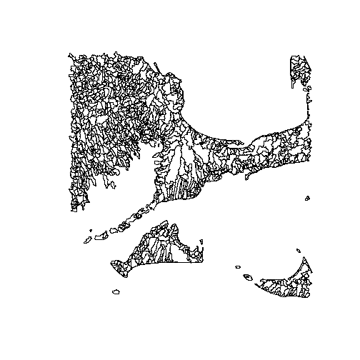

# Sample Workflow for the zonalDaymet Package
This Vignette serves as an example workflow of the `zonalDaymet` package functions.
Hydrologic catchment polygons are used as the zones over which to spatially average the climate records. 
Functions not in this package are preceded by their package source and a "::". Functions
in the `zonalDaymet` package are referred to directly. 


## Load Libraries
The `devtools` package is used to load the `zonalDaymet` package from GitHub.
The `maptools` and `sp` packages are used to load and process the spatial objects.


```r
library(devtools)
library(maptools)
library(sp)

install_github("Conte-Ecology/zonalDaymet")
library(zonalDaymet)
```


## Download Daymet Mosaic Files

The `downloadMosaic` function connects to the THREDDS server used by Daymet to
make the mosaic netCDF files avilable. Individual files are downloaded by specifying
the years and variables to download as well as the file destination directory.
There is also an option to retry failed downloads that become corrupted. This is 
a possibility if the connection is lost during the download. A progress bar will 
appear during the download as well as messages describing the existence of downloaded 
netCDF files and if any are corrupt.

```r
downloadMosaic(years = 2008:2009,
                variables = c("tmin", "prcp"),
                destinationDirectory = "C:/CLIMATE/daymet/raw",
                retryFailedDownloads = TRUE)
```


## Spatial Data Processing

The `maptools` package is used to load the spatial polygons layer. 
The shapefile should already be projected into the same coordinate system 
as the [Daymet Projection](http://daymet.ornl.gov/datasupport.html). The 
projection argument mathces the PROJ.4 documentation for the Daymet spatial 
reference, which is in the Lambert Conformal Conic system.

```r
zonesShapefile <- maptools::readShapePoly("C:/CLIMATE/daymet/spatial/Catchments01_Daymet.shp", 
                                            proj4string = CRS("+proj=lcc +ellps=WGS84 +datum=WGS84 +lat_1=25 +lat_2=60 +lat_0=42.5 +lon_0=-100 +x_0=0 +y_0=0"))
```

The spatial object is transformed into the geographic coordinate system
using the `sp` package. This step ensures that the units are in degrees, 
making the object comparable to the coordinates provided by Daymet NetCDFs
in the World Geodetic System (WGS_84).

```r
transformShapefile <- sp::spTransform(zonesShapefile,
                                        CRS("+proj=longlat +ellps=WGS84 +datum=WGS84 +no_defs +towgs84=0,0,0"),
                                        class = "SpatialPolygonsDataFrame")
```

The transformed spatial object is split into segments using the
`tileShapefile` function. This step is helpful with processing large and 
complex spatial objects that will likely exceed memory limitations if not 
broken into segments. Currently, the tile size options are 1 x 1 and 2 x 2 degrees.

```r
tiledShapefile <- tileShapefile(shapefile = transformShapefile,
                                tileDegree = 1)
```

In this example, a single tile of catchments over Cape Cod will be selected and processed.

```r
zonesPolygon <- tiledShapefile[[5]]

plot(zonesPolygon)
```

 


## Climate Record Processing: Spatial Polygons

With the Daymet mosaics downloaded and the spatial objects loaded into R, the zonalDaymet
functions are used to process the climate records. The `assignZonalRecordsToDatabase` 
function spatially maps the Daymet records to each polygon. Multiple records falling
inside the polygon get averaged to output a single record. If no points fall inside the polygon, 
the nearest point is assigned. The function iterates through netCDF files based on
the specified variables and years to process. Results are written to a SQLite database.
If the database does not exist, it is created automatically.


```r
assignZonalRecordsToDatabase(zonesShapefile = zonesPolygon,
                              zoneField = "FEATUREID",
                              zoneFieldType = "integer",
                              mosaicDirectory = "C:/CLIMATE/daymet/raw",
                              variables = c("tmin", "prcp"), 
                              years = 2008:2009,
                              databaseFilePath = "C:/CLIMATE/daymet/databases/exampleDatabase", 
                              databaseTableName = "climateRecord")
```

```
## [1] "Database already exists. Processed records will be added to existing database."
## [1] "Determining spatial relationships between Daymet NetCDF grid and shapefile."
## [1] "Spatial relationships complete."
## [1] "Spatially averaging 'tmin' records in 2008."
## [1] "Averaging complete"
## [1] "Spatially averaging 'prcp' records in 2008."
## [1] "Averaging complete"
## [1] "Done writing results into database for 2008. Elapsed time: 0.8645 minutes."
## [1] "Spatially averaging 'tmin' records in 2009."
## [1] "Averaging complete"
## [1] "Spatially averaging 'prcp' records in 2009."
## [1] "Averaging complete"
## [1] "Done writing results into database for 2009. Elapsed time: 0.806999999999999 minutes."
```

```
## [1] TRUE
```

The `returnZonalRecordsFromDatabase` accesses a database and returns records based
on specified dates and variables. Two of the polygons are selected as an example of
how this function works.

```r
zones <- unique(zonesPolygon@data$FEATUREID)[1:2]

exampleZoneDB <- returnZonalRecordsFromDatabase(databaseFilePath = "C:/CLIMATE/daymet/databases/exampleDatabase", 
                                                databaseTableName = "climateRecord",
                                                zoneField = "FEATUREID",
                                                startDate = "2008-10-01",
                                                endDate = "2008-12-31",
                                                zoneIDs = zones,
                                                variables = c("tmin", "prcp"))

head(exampleZoneDB)
```

```
## Source: local data frame [6 x 4]
## 
##   FEATUREID       Date   tmin  prcp
##       (int)      (chr)  (dbl) (dbl)
## 1 201479749 2008-10-01 14.000  5.00
## 2 201479749 2008-10-02 14.875  8.75
## 3 201479749 2008-10-03  8.500  3.00
## 4 201479749 2008-10-04  8.500  0.00
## 5 201479749 2008-10-05  5.500  0.00
## 6 201479749 2008-10-06  7.500  0.00
```

The `assignZonalRecordsToDataframe` function works the same as `assignZonalRecordsToDatabase`, 
except that it writes the results to a dataframe in the R workspace. Options to specify the 
records are the same, which means that care must be taken to ensure that the output will not 
exceed memory limitations.

```r
exampleZoneDF <- assignZonalRecordsToDataframe(zonesShapefile = zonesPolygon,
                                                zoneField = "FEATUREID",
                                                mosaicDirectory = "C:/CLIMATE/daymet/raw",
                                                variables = c("tmin", "prcp"), 
                                                years = 2008:2009)
```

```
## [1] "Determining spatial relationships between Daymet NetCDF grid and shapefile."
## [1] "Spatial relationships complete."
## [1] "Spatially averaging 'tmin' records in 2008."
## [1] "Averaging complete"
## [1] "Spatially averaging 'prcp' records in 2008."
## [1] "Averaging complete"
## [1] "Spatially averaging 'tmin' records in 2009."
## [1] "Averaging complete"
## [1] "Spatially averaging 'prcp' records in 2009."
## [1] "Averaging complete"
```

```r
zones <- unique(zonesPolygon@data$FEATUREID)[1:2]

selectZones <- exampleZoneDF[which(exampleZoneDF$FEATUREID %in% zones),]

head(selectZones)
```

```
##      FEATUREID       Date    tmin     prcp
## 1    201479651 2008-01-01  -1.000  0.00000
## 3    201479749 2008-01-01  -1.375  0.00000
## 1463 201479651 2008-01-02  -1.000 13.66667
## 1465 201479749 2008-01-02  -1.250 13.25000
## 2925 201479651 2008-01-03 -10.500  0.00000
## 2927 201479749 2008-01-03 -10.500  0.00000
```


## Climate Record Processing: Coordinates

The `returnRecordsByCoordinates` function takes user defined boundaries and returns
all of the records that fall within these bounds to a dataframe in the R workspace.
It is important that the start and end dates of the record match with the netCDF
mosaic file. Two output formats are available.

```r
exampleCoordsLong <- returnRecordsByCoordinates(areaExtent = c(-71.0, -70.0, 42.0, 43.0),
                                                  mosaicFile = "C:/CLIMATE/daymet/raw/prcp_2008.nc4",
                                                  outputFormat = "long",
                                                  startDate = "2008-01-01",
                                                  endDate = "2008-01-31")

exampleCoordsWide <- returnRecordsByCoordinates(areaExtent = c(-71.0, -70.0, 42.0, 43.0),
                                                  mosaicFile = "C:/CLIMATE/daymet/raw/prcp_2008.nc4",
                                                  outputFormat = "wide",
                                                  startDate = "2008-01-01",
                                                  endDate = "2008-01-31")
```

Long format output:

```r
str(exampleCoordsLong)
```

```
## 'data.frame':	425754 obs. of  4 variables:
##  $ Latitude : num  43.2 43.2 43.2 43.2 43.2 ...
##  $ Longitude: num  -70.9 -70.9 -70.8 -70.8 -70.8 ...
##  $ Date     : chr  "2008-01-01" "2008-01-01" "2008-01-01" "2008-01-01" ...
##  $ prcp     : num  8 8 8 8 8 8 8 8 8 8 ...
```

Wide format output:

```r
head(exampleCoordsWide)[1:6]
```

```
##   Latitude Longitude 2008-01-01 2008-01-02 2008-01-03 2008-01-04
## 1 43.23231 -70.87121          8         13          0          0
## 2 43.22908 -70.85908          8         13          0          0
## 3 43.22585 -70.84695          8         13          0          0
## 4 43.22261 -70.83482          8         13          0          0
## 5 43.21938 -70.82269          8         13          0          0
## 6 43.21614 -70.81056          8         13          0          0
```


